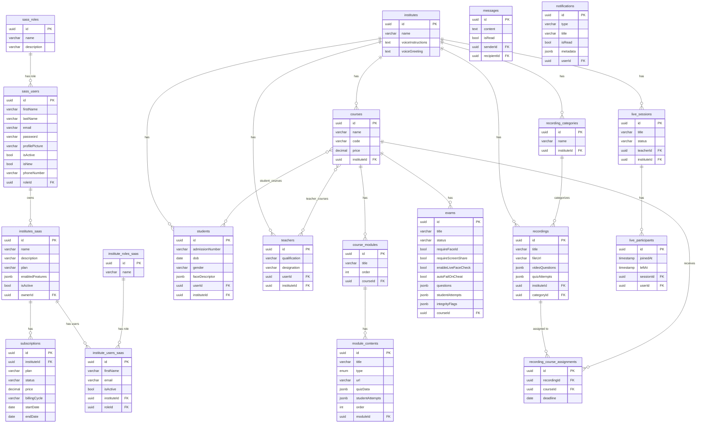

# SmartEdX — Database Schema & ER Diagrams

PostgreSQL 15. Two logical databases on a shared instance:
- **`saas_service`** — global platform: users, institutes, subscriptions
- **`institute_service`** — all LMS domain data: courses, exams, recordings, live classes, messaging

All models use TypeORM with UUID primary keys and `createdAt`/`updatedAt` timestamps.

---

## ER Diagram — SaaS Service

```
┌──────────────────────┐         ┌──────────────────────┐
│     sass_roles        │         │      sass_users       │
│──────────────────────│         │──────────────────────│
│ id          uuid PK  │◄────────│ id          uuid PK  │
│ name        varchar  │  roleId │ firstName   varchar  │
│ description varchar? │         │ lastName    varchar  │
└──────────────────────┘         │ email       varchar  │
                                  │ password    varchar  │
                                  │ profilePicture text? │
                                  │ isActive    bool     │
                                  │ isNew       bool     │
                                  │ phoneNumber varchar? │
                                  │ roleId      uuid FK  │
                                  └──────────┬───────────┘
                                             │ ownerId
                                  ┌──────────▼───────────┐
                                  │      institutes       │
                                  │──────────────────────│
                                  │ id          uuid PK  │
                                  │ name        varchar  │
                                  │ description text?    │
                                  │ location    varchar? │
                                  │ category    varchar? │
                                  │ studentCount varchar?│
                                  │ country     varchar? │
                                  │ phoneNumber varchar? │
                                  │ currency    varchar  │
                                  │ primaryUseCases text │
                                  │ defaultModel varchar │
                                  │ logo        text?    │
                                  │ isActive    bool     │
                                  │ plan        varchar  │
                                  │ enabledFeatures jsonb│
                                  │ ownerId     uuid FK  │
                                  └──────────┬───────────┘
                                             │ instituteId
                           ┌─────────────────┼─────────────────┐
                           │                 │                 │
               ┌───────────▼──────┐  ┌───────▼────────┐  ┌────▼────────────┐
               │ institute_users  │  │ subscriptions  │  │institute_roles  │
               │─────────────────│  │───────────────│  │────────────────│
               │ id     uuid PK  │  │ id   uuid PK  │  │ id    uuid PK  │
               │ firstName  var? │  │ plan  varchar │  │ name  varchar  │
               │ lastName   var? │  │ status varchar│  │ description    │
               │ email      var? │  │ price decimal │  └────────────────┘
               │ password   var? │  │ billingCycle  │
               │ isActive   bool │  │ paymentMethod │
               │ instituteId FK  │  │ startDate     │
               │ roleId     FK   │  │ endDate       │
               │ UNIQUE(email,   │  │ nextBillingDate│
               │   instituteId)  │  │ payhereOrderId│
               └─────────────────┘  └───────────────┘
```

---

## ER Diagram — Institute Service (Core)

```
┌─────────────────────┐
│     institutes       │
│─────────────────────│
│ id           uuid PK│
│ name         varchar │
│ voiceInstructions   │  (extra fields vs SaaS)
│ voiceGreeting text? │
└──────────┬──────────┘
           │ instituteId
    ┌──────┴────────────────────────────────────┐
    │              │              │              │
┌───▼──────┐  ┌────▼───────┐  ┌──▼────────┐  ┌─▼──────────┐
│ students │  │  teachers  │  │  courses  │  │inst_users  │
│──────────│  │────────────│  │───────────│  │────────────│
│ id  PK   │  │ id  PK     │  │ id  PK    │  │ id  PK     │
│ admission│  │ qualific.  │  │ name      │  │ firstName  │
│ dob      │  │ experience │  │ code      │  │ lastName   │
│ gender   │  │ designation│  │ batchNum  │  │ email      │
│ address  │  │ department │  │ coverImage│  │ password   │
│ parentName│  │ joiningDate│  │ description│  │ isActive  │
│ faceDesc │  │ userId FK  │  │ price     │  │ instituteId│
│ batchNum │  │ instituteId│  │ paymentType│  │ roleId FK  │
│ userId FK│  │ ← courses  │  │ monthlyPrice│  └────────────┘
│ instituteId│  │   (M2M)   │  │ instituteId│
│ ← courses│  └────────────┘  └─────┬─────┘
│   (M2M)  │                        │
└──────────┘                        │ courseId
                           ┌────────▼────────┐
                           │  course_modules  │
                           │─────────────────│
                           │ id      uuid PK │
                           │ title   varchar │
                           │ order   int     │
                           │ courseId FK     │
                           └────────┬────────┘
                                    │ moduleId
                           ┌────────▼────────┐
                           │ module_contents  │
                           │─────────────────│
                           │ id      uuid PK │
                           │ title   varchar │
                           │ type    enum    │
                           │ url     varchar?│
                           │ quizData  jsonb │
                           │ studentAttempts │
                           │   jsonb         │
                           │ order   int     │
                           │ moduleId FK     │
                           └─────────────────┘

M2M Join Tables:
  student_courses  (studentId, courseId)
  teacher_courses  (teacherId, courseId)
```

---

## ER Diagram — Exams & Proctoring

```
┌──────────────────────────────────────────────────────┐
│                        exams                          │
│──────────────────────────────────────────────────────│
│ id                 uuid PK                            │
│ title              varchar                            │
│ description        text?                              │
│ instructions       text?                              │
│ courseId           uuid FK → courses                  │
│ instituteId        uuid                               │
│ createdByUserId    uuid FK → institute_users (SET NULL)│
│ scheduledAt        timestamptz?                       │
│ durationMinutes    int (default 60)                   │
│ status             varchar  [draft|scheduled|active|  │
│                              completed]               │
│ passingScore       int (default 50, percentage)       │
│ maxAttempts        int (default 1)                    │
│                                                       │
│ ── Proctoring flags ─────────────────────────────────│
│ requireFaceId          bool                           │
│ requireScreenShare     bool                           │
│ enableLiveFaceCheck    bool                           │
│ autoFailOnCheat        bool                           │
│                                                       │
│ ── JSONB columns ────────────────────────────────────│
│ questions          ExamQuestion[]                     │
│ studentAttempts    { userId: ExamAttempt }            │
│ integrityFlags     { userId: IntegrityFlag[] }        │
│                                                       │
│ INDEX (courseId, instituteId)                         │
│ INDEX (status)                                        │
└──────────────────────────────────────────────────────┘

ExamQuestion (JSONB shape):
  id            string
  type          'mcq' | 'essay'
  question      string
  options?      [string, string, string, string]
  correctAnswer? 0 | 1 | 2 | 3
  explanation?  string
  sampleAnswer? string (for essay)
  marks         number

ExamAttempt (JSONB shape):
  answers           { questionId: number | string }
  score             number
  totalMarks        number
  passed            boolean
  submittedAt       ISO string
  pendingEssayReview? boolean
  autoFailed?       boolean

IntegrityFlag (JSONB shape):
  id          string
  type        IntegrityViolationType
  severity    'high' | 'medium' | 'low'
  description string
  timestamp   ISO string
  reviewed    boolean
  metadata?   object

IntegrityViolationType:
  tab_switch | face_absent | multiple_faces | face_verify_failed
  | camera_disabled | fullscreen_exit | screen_share_disabled
  | live_face_mismatch | suspicious_screen | copy_attempt
```

---

## ER Diagram — Recordings & Video Quiz

```
┌──────────────────────────────────────────┐
│          recording_categories             │
│──────────────────────────────────────────│
│ id          uuid PK                      │
│ name        varchar                      │
│ instituteId uuid FK → institutes         │
│ UNIQUE (name, instituteId)               │
└────────────────┬─────────────────────────┘
                 │ categoryId (nullable)
┌────────────────▼─────────────────────────┐
│               recordings                  │
│──────────────────────────────────────────│
│ id            uuid PK                    │
│ title         varchar                    │
│ fileName      varchar?                   │
│ fileUrl       varchar?  (MinIO URL)      │
│ duration      varchar?                   │
│ instituteId   uuid FK → institutes       │
│ uploadedById  uuid FK → inst_users       │
│ categoryId    uuid FK → rec_categories?  │
│                                          │
│ ── Video Quiz (JSONB) ──────────────────│
│ videoQuestions  VideoQuestion[]          │
│ quizAttempts    { userId: VideoQuizAttempt }│
└─────────────────┬────────────────────────┘
                  │ recordingId
┌─────────────────▼────────────────────────┐
│      recording_course_assignments         │
│──────────────────────────────────────────│
│ id           uuid PK                     │
│ recordingId  uuid FK → recordings        │
│ courseId     uuid FK → courses           │
│ deadline     date                        │
└──────────────────────────────────────────┘

VideoQuestion (JSONB shape):
  id            string
  atSeconds     number   (timestamp to show question)
  question      string
  options       [string, string, string, string]
  correctAnswer 0 | 1 | 2 | 3
  marks         number

VideoQuizAttempt (JSONB shape):
  answers       { questionId: number }
  score         number
  totalMarks    number
  submittedAt   ISO string
```

---

## ER Diagram — Messaging & Notifications

```
┌──────────────────────────────────────┐
│               messages                │
│──────────────────────────────────────│
│ id          uuid PK                  │
│ senderId    uuid FK → inst_users     │
│ recipientId uuid FK → inst_users     │
│ content     text                     │
│ isRead      bool                     │
│ instituteId uuid                     │
│ INDEX (senderId, recipientId)        │
│ INDEX (instituteId)                  │
└──────────────────────────────────────┘

┌──────────────────────────────────────┐
│             notifications             │
│──────────────────────────────────────│
│ id          uuid PK                  │
│ userId      uuid FK → inst_users     │
│ instituteId uuid                     │
│ type        varchar  [message|email| │
│                       reminder|      │
│                       cheat_alert]   │
│ title       varchar                  │
│ body        text                     │
│ isRead      bool                     │
│ metadata    jsonb?                   │
│ INDEX (userId, instituteId)          │
│ INDEX (isRead)                       │
└──────────────────────────────────────┘
```

---

## ER Diagram — Live Classes

```
┌──────────────────────────────────────────┐
│              live_sessions                │
│──────────────────────────────────────────│
│ id               uuid PK                 │
│ title            varchar                 │
│ description      varchar?                │
│ courseId         varchar?                │
│ courseName       varchar?                │
│ teacherId        uuid FK → inst_users    │
│ instituteId      uuid FK → institutes    │
│ status           varchar [scheduled|     │
│                           live|ended]    │
│ scheduledAt      timestamp?              │
│ startedAt        timestamp?              │
│ endedAt          timestamp?              │
│ participantCount int                     │
│ INDEX (instituteId, status)              │
│ INDEX (teacherId, instituteId)           │
└────────────────┬─────────────────────────┘
                 │ sessionId
┌────────────────▼─────────────────────────┐
│            live_participants              │
│──────────────────────────────────────────│
│ id          uuid PK                      │
│ sessionId   uuid FK → live_sessions      │
│ userId      uuid FK → inst_users         │
│ instituteId uuid                         │
│ joinedAt    timestamp?                   │
│ leftAt      timestamp?                   │
│ UNIQUE (sessionId, userId)               │
└──────────────────────────────────────────┘
```

---

## Full Mermaid ER Diagram



---

## Column Type Reference

| TypeORM Type | PostgreSQL Type | Notes |
|---|---|---|
| `uuid` | UUID | PK auto-generated |
| `varchar` | VARCHAR | default 255 |
| `text` | TEXT | long strings |
| `int` | INTEGER | |
| `decimal(10,2)` | NUMERIC(10,2) | monetary |
| `bool` | BOOLEAN | |
| `date` | DATE | |
| `timestamp` | TIMESTAMP | without TZ |
| `timestamptz` | TIMESTAMPTZ | with TZ |
| `jsonb` | JSONB | structured JSON, indexed |
| `enum` | ENUM type | database-level enum |

## JSONB Column Summary

| Table | Column | Shape |
|---|---|---|
| `institutes` | `enabledFeatures` | `string[]` (e.g. `['ai_tools', 'voice_agent']`) |
| `module_contents` | `quizData` | Quiz config + questions array |
| `module_contents` | `studentAttempts` | `{ studentId: { score, attemptedAt } }` |
| `exams` | `questions` | `ExamQuestion[]` |
| `exams` | `studentAttempts` | `{ userId: ExamAttempt }` |
| `exams` | `integrityFlags` | `{ userId: IntegrityFlag[] }` |
| `students` | `faceDescriptor` | `number[]` (512-d float array) |
| `recordings` | `videoQuestions` | `VideoQuestion[]` |
| `recordings` | `quizAttempts` | `{ userId: VideoQuizAttempt }` |
| `notifications` | `metadata` | Arbitrary extra data |
